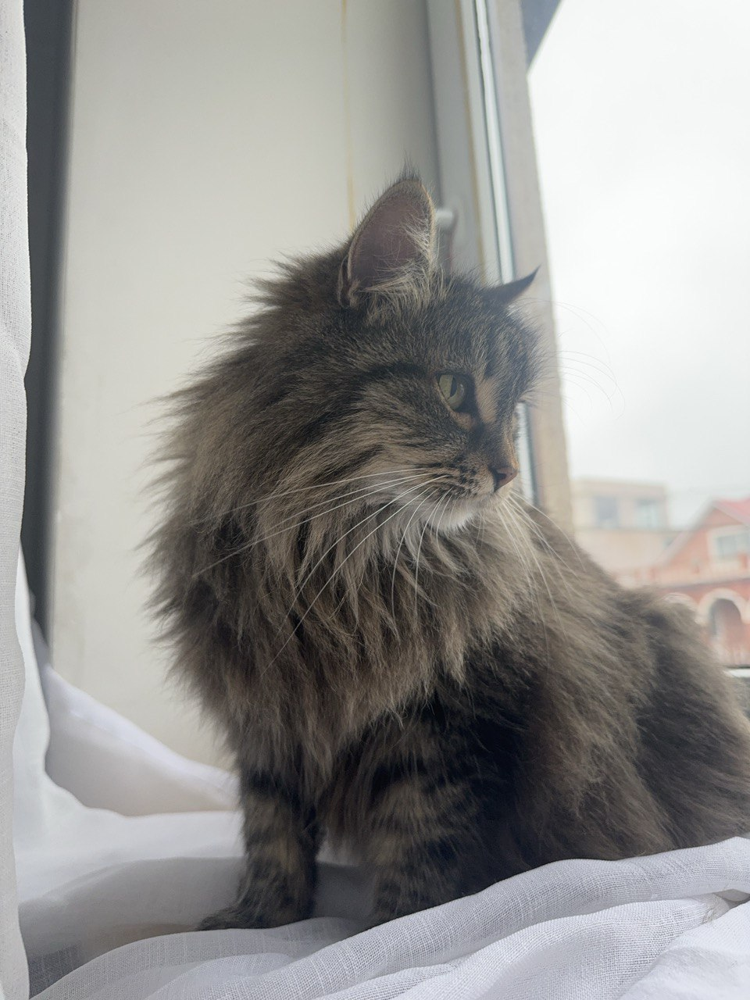
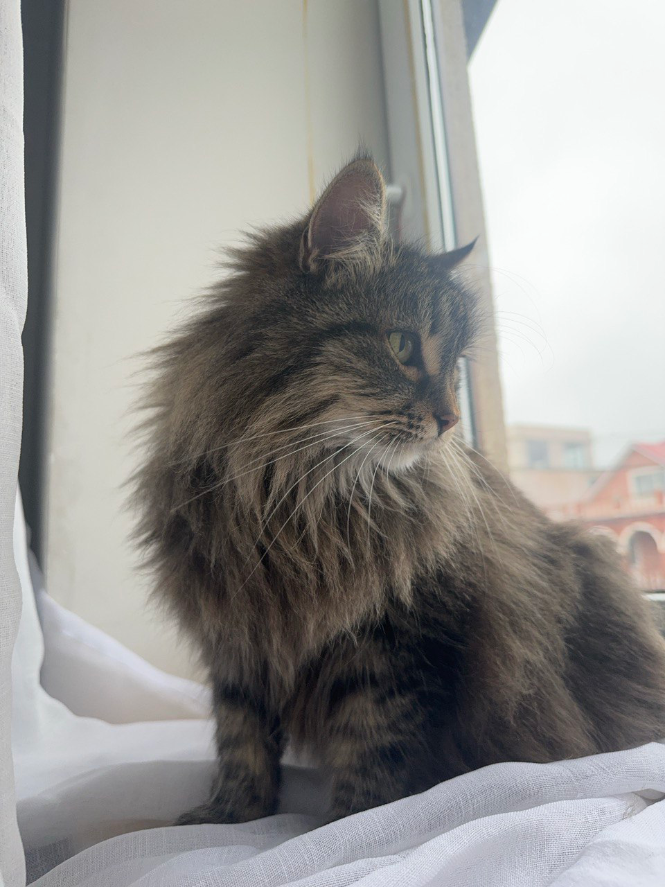
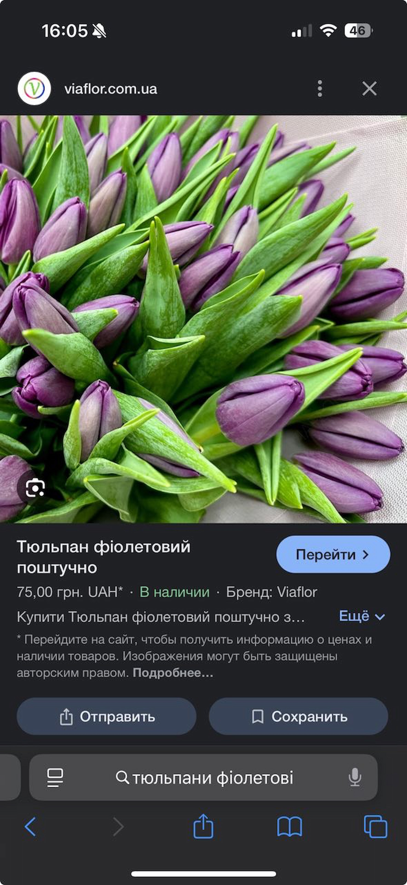
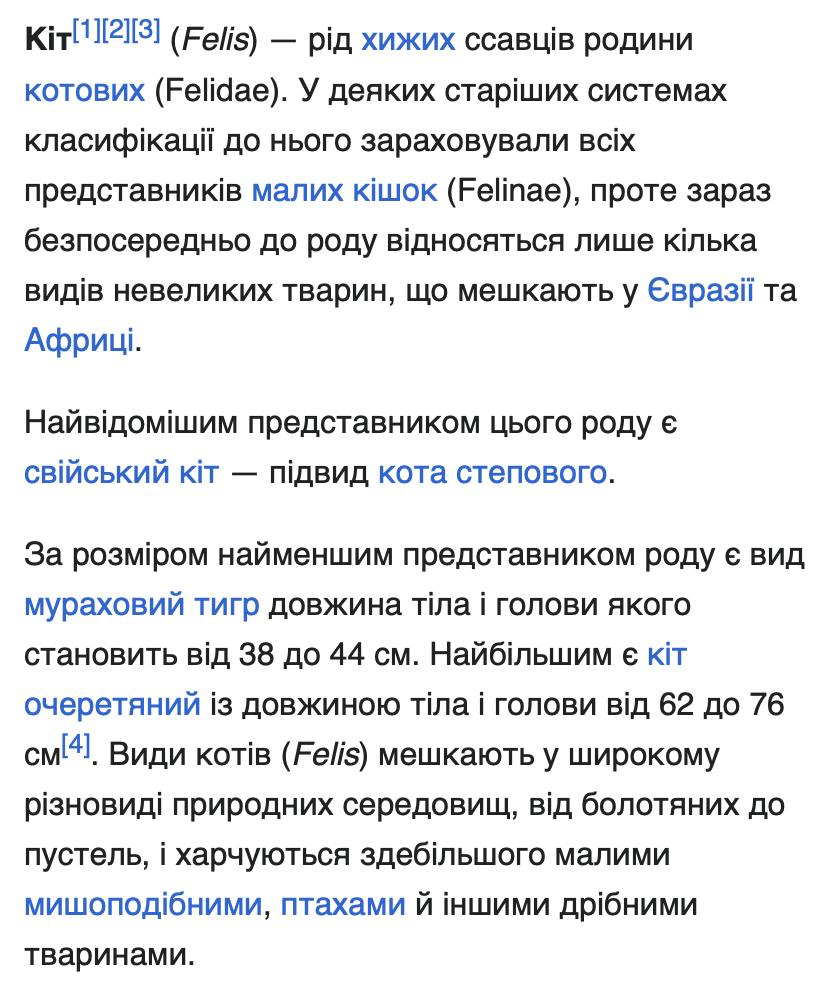
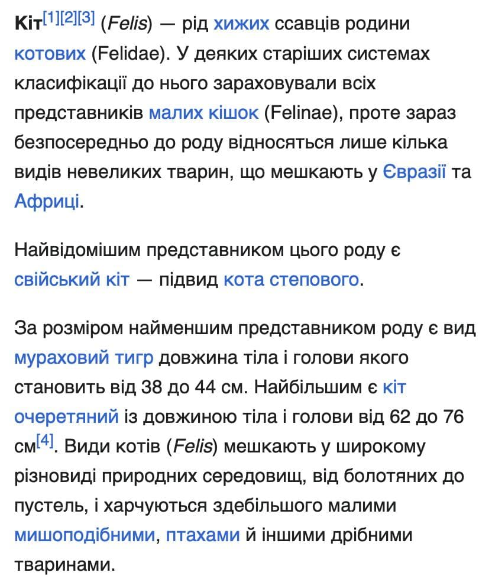
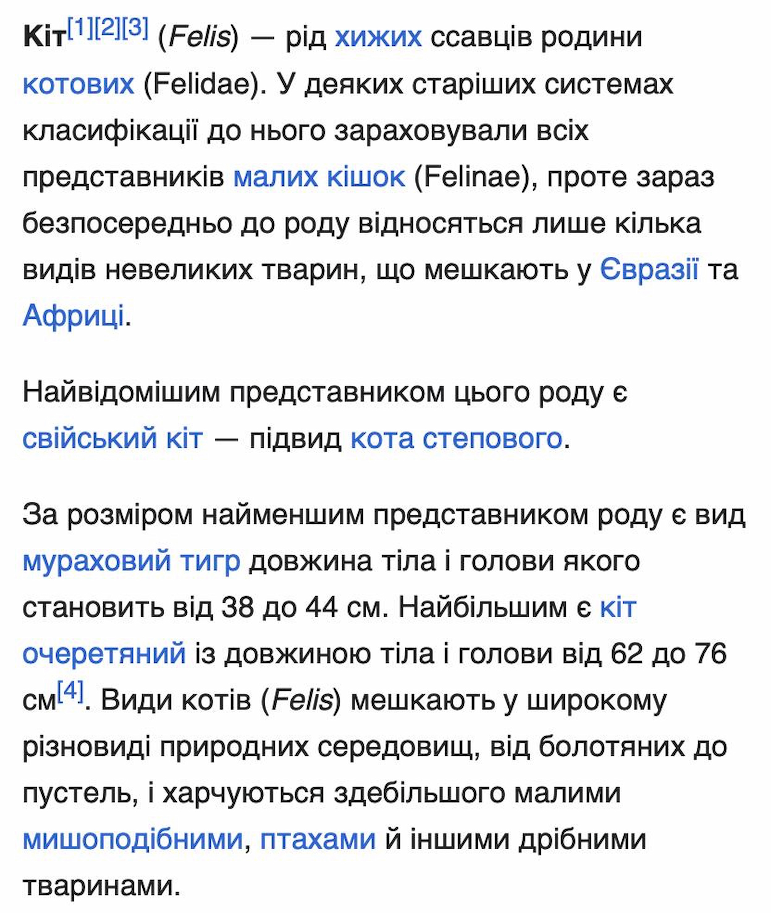

<table>
  <tr>
    <th>Зображення</th>
    <th>Початковий розмір</th>
    <th>WEBp</th>
    <th>MozJPEG</th>
    <th>1200 px</th>
    <th>600 px</th>
    <th>3x</th>
  </tr>
  <tr>
    <td><strong>Фото (JPG)</strong></td>
    <td>198 656 Б (194 КБ)</td>
    <td>773 120 Б (755 КБ)</td>
    <td>93 798.4 Б (91.6 КБ)</td>
    <td>1 509 949.44 Б (1.44 MБ)</td>
    <td>435 200 Б (425 КБ)</td>
    <td>6 417 285.12 Б (6.12 MБ)</td>
  </tr>
  <tr>
    <td><strong>Скріншот (JPG)</strong></td>
    <td>126 976 Б (124 КБ)</td>
    <td>570 368 Б (557 КБ)</td>
    <td>133 146 Б (95.2 КБ)</td>
    <td>78 133 Б (532 КБ)</td>
    <td>217 088 Б (212 КБ)</td>
    <td>908 288 Б (887 КБ)</td>
  </tr>
  <tr>
    <td><strong>Скріншот з текстом (JPG)</strong></td>
    <td>118 784 Б (116 КБ)</td>
    <td>224 256 Б (219 КБ)</td>
    <td>91 955.2 Б (89.8 КБ)</td>
    <td>368 640 Б (360 КБ)</td>
    <td>138 240 Б (135 КБ)</td>
    <td>138 240 Б (934 КБ)</td>
  </tr>
</table>

### original Agata.jpg

### Agata.webp

### Agata-mozjpeg.jpg

### Agata-web_1200.jpg

### Agata-mob_600.jpg

### Agata-retina_3x.jpg

### original flowers.jpg

### flowers.webp

### flowers-mozjpeg.jpg

### flowers-web_1200.jpg

### flowers-mob_600.jpg

### flowers-retina_3x.jpg

### original text.jpg

### text.webp

### text-mozjpeg.jpg

### text-web_1200.jpg

### text-mob_600.jpg

### text-retina_3x.jpg

## Висновки

### 1. Який формат найкраще підходить для кожного типу зображень?
- **Фотографії**: Найкраще використовувати формати стиснення з втратою якості (lossy), такі як MozJPEG або WebP (lossy), оскільки вони забезпечують значне зменшення ваги без значної втрати якості. Формат AVIF також є хорошим вибором для фотографій, оскільки має високу ступінь стиснення при збереженні якості.
- **Скріншоти**: Для скріншотів оптимальними форматами є PNG (lossless) або WebP (lossless), оскільки вони зберігають всі деталі зображення без втрати якості.
- **Графічні зображення з текстом**: Для таких зображень, де важлива чіткість тексту, рекомендовано використовувати PNG (lossless) або WebP (lossless), оскільки ці формати забезпечують високу якість без втрати текстових елементів.

### 2. Як зміна розміру впливає на оптимізацію?
Зменшення розміру зображення для різних цільових застосувань дозволяє значно зменшити його вагу, що позитивно впливає на швидкість завантаження сторінок. Проте, важливо знайти оптимальний баланс, оскільки занадто велике зменшення розміру може призвести до втрати чіткості та деталізації зображення, що погіршує користувацький досвід, особливо на Retina-дисплеях.

### 3. Як правильно адаптувати зображення для Retina-дисплеїв?
Для адаптації зображень для Retina-дисплеїв слід створювати версії зображень з розширенням 2x або 3x. Це дозволяє зберегти чіткість та деталізацію зображення при відображенні на дисплеях з високою щільністю пікселів. У веб-розробці можна використовувати атрибут `srcset` для завантаження відповідних версій зображень залежно від роздільної здатності екрану.