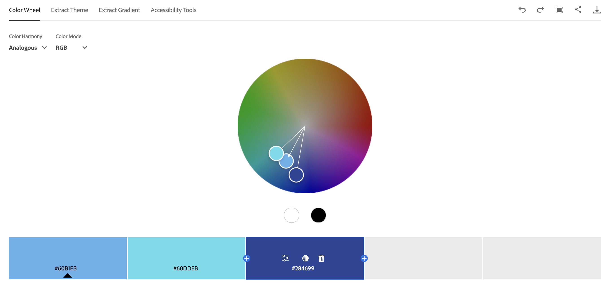
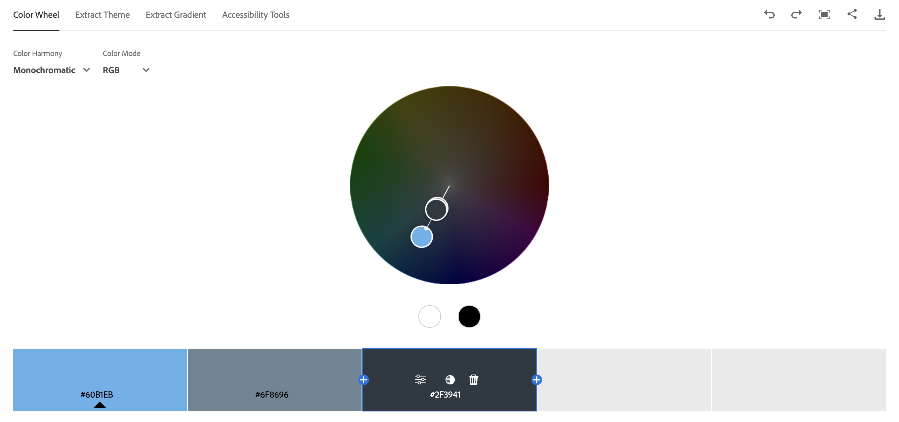
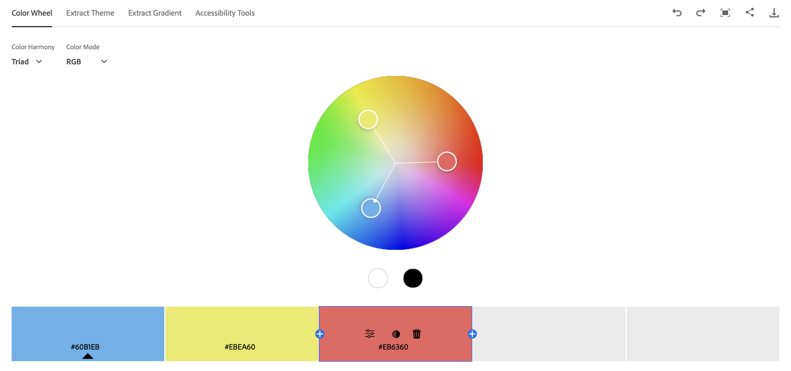
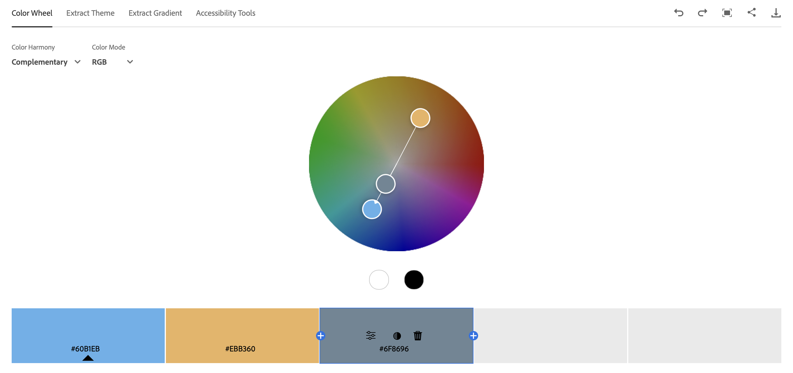
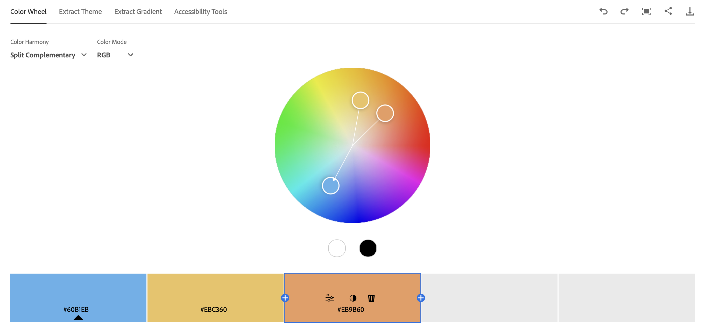
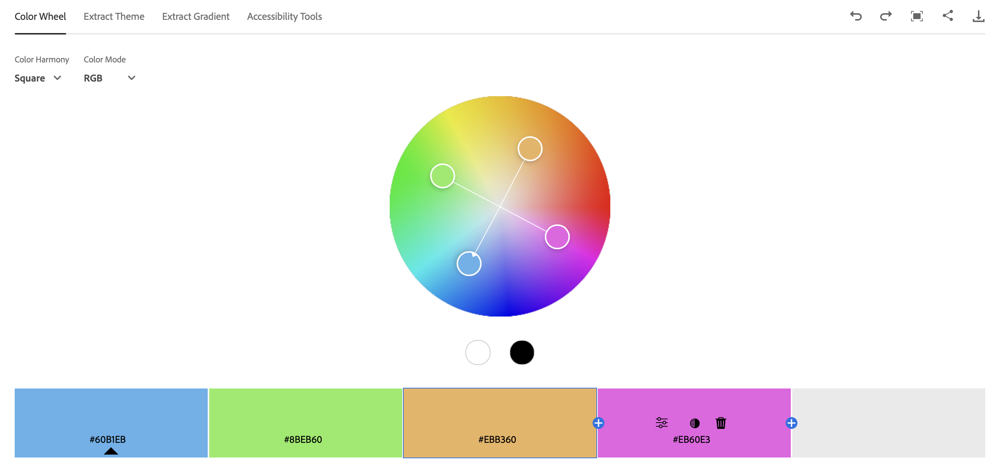
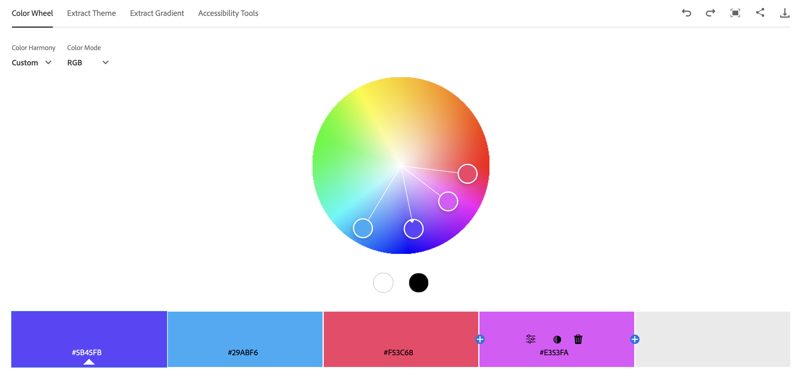
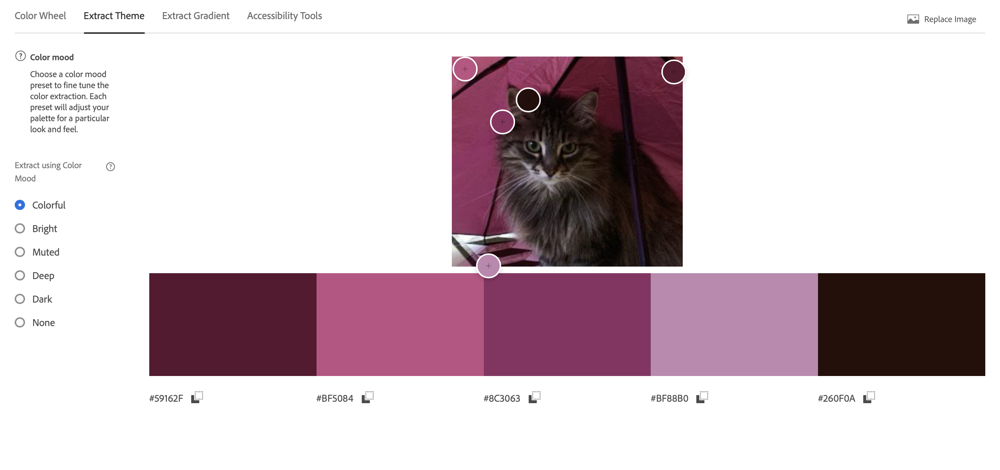
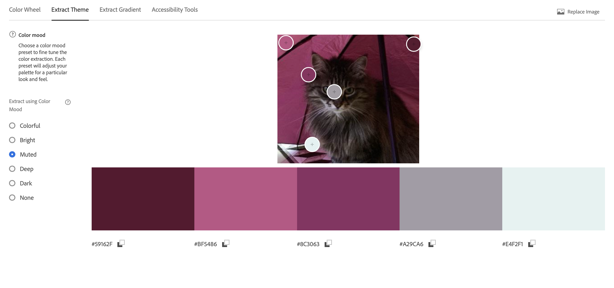
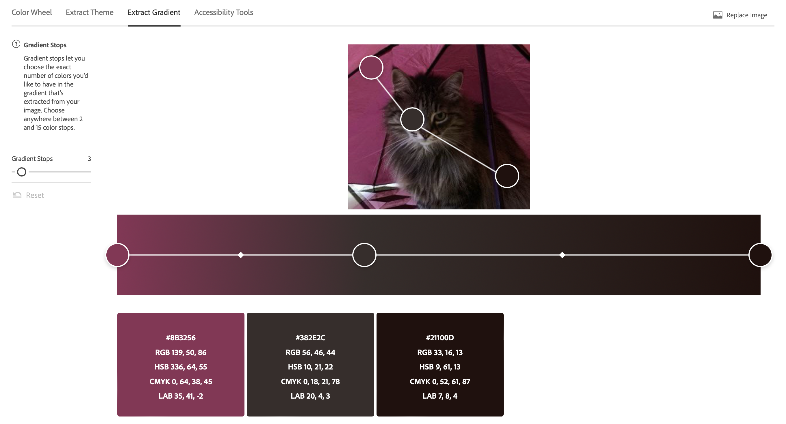

# ПЗ-11 Дослідження кольорових гармоній та інструментів аналізу кольору в Adobe Color

## Виконала:

**Чернова Анна**  
**Група: ІПЗ-2.03**

---

Усі файли доступні в репозиторії на [GitHub](https://github.com/annforia/UI-UX).

---

## Теоретична частина

**Кольорова гармонія** — поєднання кольорів, яке створює естетично приємне враження. Використовується в дизайні для досягнення візуального балансу та емоційного впливу.

**Типи кольорової гармонії:**

- **Analogous (аналогічна):** поєднання сусідніх кольорів на колірному колесі.
- **Monochromatic (монохроматична):** використання відтінків одного кольору.
- **Triad (тріада):** три кольори, рівновіддалені на колірному колесі.
- **Complementary (комплементарна):** поєднання протилежних кольорів.
- **Split Complementary (розділена комплементарна):** базовий колір і два сусідні до його комплементарного.
- **Square (квадратна):** чотири кольори, рівновіддалені на колірному колесі.
- **Custom (власна побудова):** довільне поєднання кольорів за власним вибором.

**Колірні моделі:**

- **RGB:** основна модель для екранів.
- **HSB:** визначає колір через відтінок, насиченість та яскравість.
- **LAB:** модель, що наближена до сприйняття кольору людиною.

**Контрастність та WCAG:**

- **AA:** мінімум 4.5:1 для звичайного тексту, 3:1 для великого.
- **AAA:** мінімум 7:1 для звичайного, 4.5:1 для великого.

## Практична частина

### 1. Робота з колірним колесом

**Базовий колір:** `#284699`

#### Analogous

- **Скрін з сайту:** 
- **Опис:** Створює спокійний настрій.

#### Monochromatic

- **Скрін з сайту:** 
- **Опис:** Єдність, стриманість.

#### Triad

- **Скрін з сайту:** 
- **Опис:** Контраст і гармонія.

#### Complementary

- **Скрін з сайту:** 
- **Опис:** Акцент, динамічність.

#### Split Complementary

- **Скрін з сайту:** 
- **Опис:** Збалансований контраст.

#### Square

- **Скрін з сайту:** 
- **Опис:** Яскравий, насичений вигляд.

#### Custom

- **Скрін з сайту:** 
- **Опис:** Унікальність і свобода.

### 2. Extract Theme

- **Скрін з сайту (Colorful):** 
- **Скрін з сайту (Muted):** 
- **Опис:** Muted краще для UI — менш нав’язлива.

### 3. Extract Gradient

- **Скрін з сайту:** 
- **Опис:** Плавний перехід, естетика.

### 4. Accessibility Tools

- **Скрін з сайту:** 
- **Кольори:** текст — `#ffffff`, фон — `#284699`
- **Контраст:** 5.66:1
- **Проходить:** AA для звичайного, AAA для великого тексту.

## Висновки

У процесі ознайомлення з інструментами **Adobe Color** та аналізу кольорових гармоній було отримано наступні практичні результати:

### 1. Кольорові гармонії

- Гармонії **Analogous**, **Monochromatic**, **Split Complementary** формують врівноважені та спокійні палітри, ідеальні для UI-дизайну.
- Поєднання **Complementary** і **Triad** створюють яскраві, контрастні комбінації. Ефективні для акцентів, але потребують обережного застосування.
- Варіанти **Square** і **Custom** підходять для творчих, неформальних рішень у дизайні.

### 2. Extract Theme

- Тема **Muted** найкраще підходить для інтерфейсів — виглядає спокійно та не відволікає.
- Тема **Colorful** доречна у креативних або дитячих проєктах, де потрібна яскравість.

### 3. Extract Gradient

- Градієнт з трьома зупинками (Gradient Stops = 3) забезпечує м’який перехід між кольорами, створюючи візуальну глибину.

### 4. Перевірка доступності (WCAG 2.1)

- **Колір тексту:** `#ffffff`
- **Колір фону:** `#284699`
- **Контрастність:** `8.66 : 1`

**Результати перевірки:**

- **Звичайний текст (до 17pt):** Відповідає (рівень **AA**)
- **Великий текст (від 18pt або 14pt жирний):** Відповідає (рівень **AAA**)
- **Графічні елементи (іконки, кнопки):** Відповідає

### Узагальнений висновок

Для UI-дизайну найкраще підходять гармонії **Analogous** та **Monochromatic**, а також палітри типу **Muted**, що забезпечують комфортне сприйняття. Дотримання стандартів **WCAG 2.1** гарантує хорошу читабельність і доступність для всіх користувачів.

