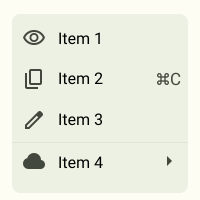

# ПЗ-4 Завдання для самостійного опрацювання у Figma.

## Виконала:

**Чернова Анна**  
**Група: ІПЗ-2.03**

---

Усі файли доступні в репозиторії на [GitHub](https://github.com/annforia/UI-UX).

---

## Basic:

Посилання на проєкт у [Figma](https://www.figma.com/design/bbBGjoWibDOKmkCJ4ec1uG/UI-UX_4?node-id=0-1&t=c7t0VRJS447AxI9H-1)

