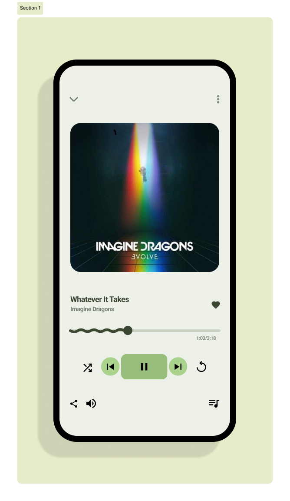

# ПЗ-7 Завдання для самостійного опрацювання у Figma.

## Виконала:

**Чернова Анна**  
**Група: ІПЗ-2.03**

---

Усі файли доступні в репозиторії на [GitHub](https://github.com/annforia/UI-UX).

---

## Medium:

## Advanced:

Посилання на проєкт у [Figma](https://www.figma.com/design/RoFvN8ZbrUIdzLLg6BjzmZ/UI-UX_7?node-id=2002-2&t=JHsl1gIb6NXQM7jI-1)

