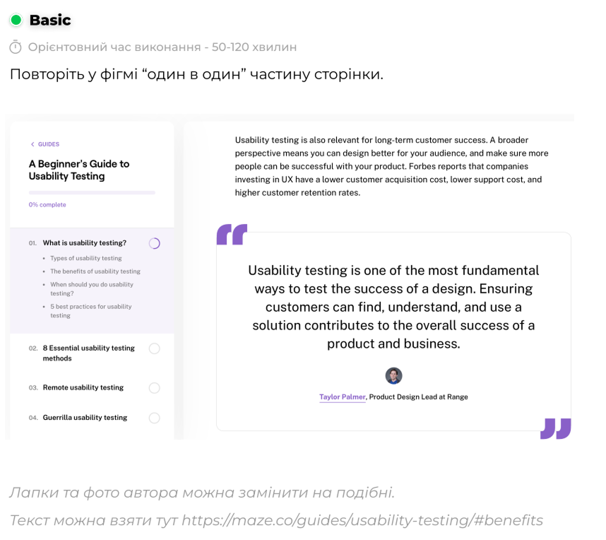

# ПЗ-8 Робота з макетами - Завдання для самостійного опрацювання

## Виконала:

**Чернова Анна**  
**Група: ІПЗ-2.03**

---

Усі файли доступні в репозиторії на [GitHub](https://github.com/annforia/UI-UX).

---

## Результати

| Елемент             | Результат                 |
| ------------------- | ------------------------- |
| Референс            |      |
| **Виконана робота** | **** |

Посилання на проєкт у [Figma](https://www.figma.com/design/e3lRcHvR5ms5IIg3wcpJgB/UI-UX_8?node-id=1-16&t=8blqBakAhZAFb4Jj-1)

